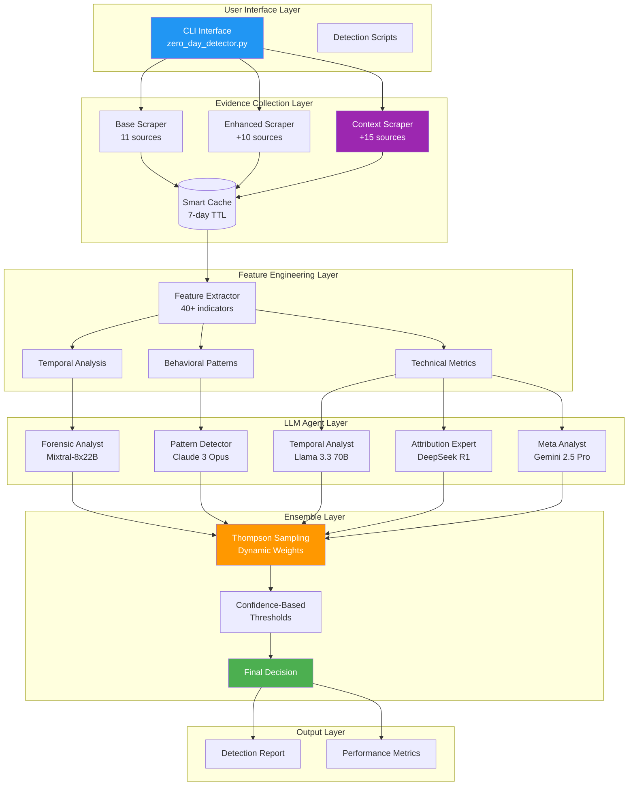

# System Architecture

**Version 3.12.2** - Last Updated: 2025-08-04

## Overview

The Zero-Day Detection System uses a multi-layered architecture combining web scraping, feature engineering (including responsible disclosure detection), multi-agent LLM analysis, and ensemble decision-making with dynamic thresholds.

## Architecture Diagram



## Component Details

### 1. Evidence Collection Layer

#### Base Scraper (11 sources)
- **NVD**: CVE details, CVSS scores, references
- **CISA KEV**: Known exploited vulnerabilities catalog
- **ExploitDB**: Public exploit availability
- **GitHub**: PoC repositories and code
- **MITRE ATT&CK**: Technique mappings
- **VirusTotal**: Malware associations
- **Security News**: Media coverage
- **Vendor Advisories**: Official statements
- **Social Media**: Twitter/Reddit discussions
- **Threat Intel**: APT associations
- **Patch Timeline**: Vulnerability lifecycle

#### Enhanced Scraper (+10 sources)
- **Government Alerts**: Multi-country security bulletins
- **Security Researchers**: Expert analyses
- **Underground Forums**: Dark web mentions
- **Honeypot Data**: Active exploitation
- **Vulnerability Scanners**: Detection signatures
- **Bug Bounty**: Disclosure timelines
- **Conference Talks**: Security presentations
- **Academic Papers**: Research coverage
- **Incident Response**: IR reports
- **Threat Feeds**: Commercial intel

#### Context Enhancement Scraper (+15 sources)
- **Documentation**: Official docs, man pages
- **Code Analysis**: Vulnerable code snippets
- **Full Discussions**: Complete threads with comments
- **Technical Blogs**: In-depth analyses
- **Patch Details**: Commit diffs and changes
- **Historical Vulnerabilities**: Similar CVE patterns
- **Exploit Tutorials**: Step-by-step guides
- **Configurations**: Docker, K8s, Terraform examples
- **Deployment Guides**: Architecture docs
- **Attack Patterns**: MITRE techniques
- **Incident Analysis**: Forensic reports
- **Mitigations**: Workarounds and fixes
- **Security Advisories**: Vendor bulletins
- **Forensic Evidence**: IOCs and artifacts
- **Related Commits**: Code changes

### 2. Feature Engineering Layer

#### Feature Categories
1. **Temporal Features** (15 features)
   - Days to KEV listing
   - PoC emergence velocity
   - Patch release timing
   - Disclosure patterns

2. **Evidence Features** (20 features)
   - CISA KEV presence
   - Exploit availability
   - APT associations
   - Government alerts

3. **Technical Features** (10 features)
   - CVSS scores
   - Attack complexity
   - Privileges required
   - User interaction needs

4. **Behavioral Features** (5 features)
   - Community buzz
   - Adoption velocity
   - Underground activity
   - Media coverage

5. **Responsible Disclosure Features** (6 features) - **NEW in v3.12.2**
   - Security researcher credits
   - Bug bounty mentions
   - Disclosure keywords
   - Branded vulnerability names
   - Responsible disclosure score
   - Timeline coordination patterns

### 3. LLM Agent Layer

#### Agent Specializations
1. **ForensicAnalyst** (Mixtral-8x22B)
   - Technical vulnerability analysis
   - Code pattern recognition
   - Exploit feasibility assessment

2. **PatternDetector** (Claude 3 Opus)
   - Zero-day linguistic patterns
   - Disclosure anomalies
   - Emergency patch indicators

3. **TemporalAnalyst** (Llama 3.3 70B)
   - Timeline consistency
   - Temporal anomalies
   - Lifecycle analysis

4. **AttributionExpert** (DeepSeek R1)
   - APT group behavior
   - Attack campaign patterns
   - Threat actor preferences

5. **MetaAnalyst** (Gemini 2.5 Pro)
   - Cross-agent validation
   - Holistic assessment
   - Confidence calculation

### 4. Ensemble Layer

#### Thompson Sampling
- **Dynamic Weight Optimization**
  - Beta distributions for each agent
  - Success/failure tracking
  - Exploration vs exploitation balance
  - Real-time weight updates

#### Confidence-Based Thresholds (v3.12.2)
```json
{
  "HIGH": 0.50,      // ≥80% confidence
  "MEDIUM": 0.50,    // 60-80% confidence (increased from 0.45)
  "LOW": 0.45,       // 40-60% confidence (increased from 0.40)
  "VERY_LOW": 0.70,  // <40% confidence (increased from 0.65)
  "DEFAULT": 0.55    // Default threshold (increased from 0.50)
}
```

### 5. Data Flow

1. **Input**: CVE-YYYY-NNNNN identifier
2. **Scraping**: Parallel collection from 21+ sources
3. **Caching**: 7-day cache for efficiency
4. **Feature Extraction**: 40+ objective indicators
5. **Context Building**: Massive prompts with evidence
6. **LLM Analysis**: 5 agents analyze in parallel
7. **Ensemble**: Thompson Sampling weighted average
8. **Threshold**: Dynamic based on confidence
9. **Output**: Binary decision + confidence score

## Performance Characteristics

### Timing
- **Basic Scraping**: ~2-5 seconds
- **Context Enhancement**: ~15-30 seconds
- **LLM Analysis**: ~15-30 seconds (parallel)
- **Total Detection**: ~30-60 seconds per CVE

### Resource Usage
- **Memory**: ~2GB for full context
- **Network**: ~50-100 API calls per CVE
- **Storage**: ~10MB cache per CVE
- **CPU**: Minimal (mostly I/O bound)

### Scalability
- **Parallel Processing**: Up to 8 CVEs simultaneously
- **Rate Limiting**: Automatic backoff
- **Caching**: Reduces repeat API calls by 90%
- **Batch Mode**: Process 100+ CVEs efficiently

## Configuration

### Key Files
- `config/optimized_thresholds.json`: Detection thresholds
- `config/models.yaml`: LLM model configurations
- `config/settings.py`: System settings

### Environment Variables
- `OPENROUTER_API_KEY`: Required for LLM access
- `DEBUG_MODE`: Enable detailed logging
- `CACHE_DIR`: Cache location (default: `./cache`)

## Error Handling

### Graceful Degradation
- Missing sources: Continue with available data
- API failures: Retry with exponential backoff
- LLM errors: Use remaining agents
- Network issues: Fall back to cache

### Monitoring
- Detailed logging at multiple levels
- Performance metrics tracking
- API usage monitoring
- Error rate tracking

## Security Considerations

- **No Credentials in Code**: API keys via environment
- **Input Validation**: CVE format verification
- **Rate Limiting**: Prevent abuse
- **Cache Isolation**: Per-CVE cache files
- **Read-Only Operations**: No system modifications

## Future Enhancements

1. **Real-time Monitoring**: Stream processing
2. **ML Baseline**: Traditional ML comparison
3. **API Service**: REST API interface
4. **Dashboard**: Web-based UI
5. **Distributed Processing**: Multi-node support