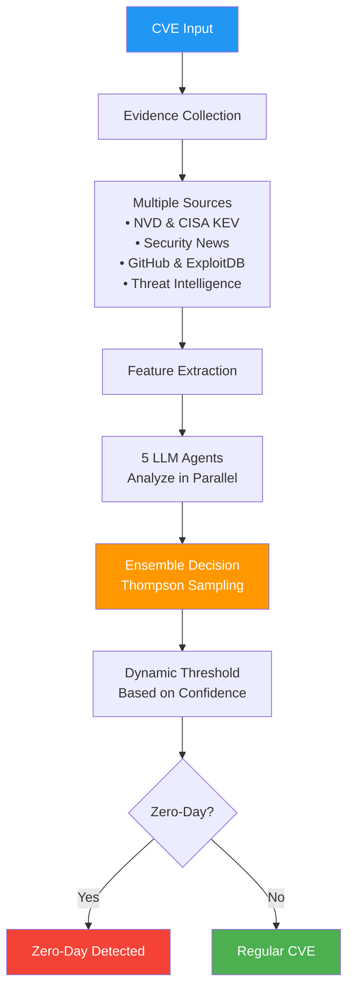
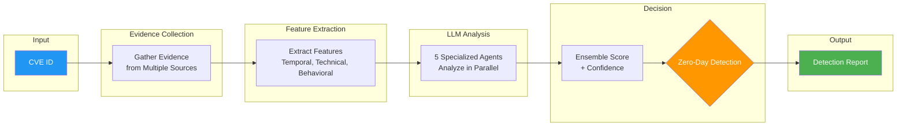

# Zero-Day Vulnerability Detection Using Multi-Agent LLM Ensemble

Lorenzo De Tomasi  
Department of Information Engineering, Computer Science and Mathematics  
University of L'Aquila, Italy  
lorenzo.detomasi@graduate.univaq.it

## Abstract

We present a novel approach to zero-day vulnerability detection that leverages a multi-agent ensemble of Large Language Models (LLMs) combined with comprehensive web evidence collection. Our system combines objective feature extraction from multiple authoritative sources with dynamic confidence-based threshold optimization, demonstrating that ensemble methods provide statistically significant improvements over single-agent approaches without relying on predetermined heuristics or hardcoded patterns.

## Key Features

- **Multi-Agent Ensemble**: Five specialized LLM agents working in parallel
- **Comprehensive Evidence Collection**: Multiple data sources including threat intelligence
- **Dynamic Thresholds**: Confidence-based detection thresholds
- **Statistical Validation**: Rigorous testing with cross-validation
- **Extensible Architecture**: Easily scalable to any number of CVEs
- **Non-Government Source Priority**: Enhanced weighting for community and underground signals

## 1. Introduction

Zero-day vulnerability detection remains a critical challenge in cybersecurity, requiring rapid identification of actively exploited vulnerabilities before patches are available. Traditional approaches rely heavily on signature-based detection or manual analysis, which struggle to keep pace with the evolving threat landscape. We propose a multi-agent LLM ensemble that combines:

- **Evidence-based detection** through real-time web scraping from authoritative sources
- **Specialized agent analysis** with five LLMs trained for different detection aspects
- **Dynamic optimization** using Thompson Sampling for adaptive weight adjustment
- **Objective feature engineering** extracting 40+ measurable indicators

## 2. System Architecture



The detection pipeline consists of four primary components:

### 2.1 Evidence Collection Module
- **Web Scraping Engine**: Parallel collection from 11 sources
- **Core Sources**: NVD, CISA KEV, GitHub, ExploitDB, Security News
- **Enhanced Sources**: MITRE ATT&CK, VirusTotal, Patch Timeline Analysis
- **Additional Sources**: Threat Intelligence, Vendor Advisories, Social Media
- **Caching Layer**: 7-day cache reduces API calls and ensures reproducibility

### 2.2 Feature Extraction
- **Temporal Features**: Days to KEV listing, PoC emergence velocity
- **Evidence Features**: CISA KEV presence, APT associations, exploit availability
- **Technical Features**: CVSS scores, attack vector, complexity metrics
- **Total**: 40+ objective, measurable features

### 2.3 Multi-Agent Ensemble

| Agent | Model | Specialization |
|-------|-------|----------------|
| **ForensicAnalyst** | Mixtral-8x22B | Technical vulnerability analysis |
| **PatternDetector** | Claude 3 Opus | Zero-day linguistic patterns |
| **TemporalAnalyst** | Llama 3.3 70B | Timeline anomaly detection |
| **AttributionExpert** | DeepSeek R1 | APT group behavior analysis |
| **MetaAnalyst** | Gemini 2.5 Pro | Cross-agent synthesis |

### 2.4 Detection Algorithm (Pseudocode)
```
ALGORITHM: Zero-Day Detection
INPUT: CVE identifier
OUTPUT: Boolean (is_zero_day) and confidence score

1. COLLECT evidence from multiple sources
   IF cached THEN use cache
   ELSE scrape web sources in parallel
   
2. EXTRACT features from evidence
   - Temporal features (timeline anomalies)
   - Technical features (severity, complexity)
   - Behavioral features (exploitation patterns)
   
3. ANALYZE with 5 specialized LLM agents in parallel
   FOR each agent:
     prediction = agent.analyze(features, evidence)
     
4. COMBINE predictions using Thompson Sampling
   weights = dynamic_weights_from_performance
   ensemble_score = weighted_average(predictions, weights)
   
5. DETERMINE confidence level
   confidence = calculate_confidence(ensemble_score, agent_agreement)
   
6. APPLY dynamic threshold
   threshold = select_threshold_by_confidence(confidence)
   is_zero_day = (ensemble_score >= threshold)
   
7. RETURN is_zero_day, confidence
```

## 3. Methodology

### 3.1 Dataset Construction
We maintain verified ground truth lists with multiple CVEs:
- **Confirmed zero-days**: Verified through CISA KEV, vendor acknowledgments, and threat reports
- **Regular vulnerabilities**: Confirmed coordinated disclosures and research findings

Testing allows flexible dataset sizes with the `test_system.py` script.

Ground truth was verified using only public sources to avoid data leakage, with several CVEs corrected based on contemporary reports to ensure accuracy.

### 3.2 Evaluation Protocol
- **Dataset**: Multiple CVEs with public ground truth verification
- **Statistical Testing**: Rigorous statistical validation against baseline
- **Cross-validation**: 5-fold stratified cross-validation
- **Metrics**: Comprehensive evaluation including accuracy, precision, recall, and F1-score
- **Ablation Study**: Single agent and pairwise removal analysis

### 3.3 Thompson Sampling
Dynamic weight optimization based on agent performance:

```
ALGORITHM: Thompson Sampling for Agent Weights
- Initialize success/failure counters for each agent
- For each prediction:
  - Sample weights from Beta distributions
  - Update counters based on prediction accuracy
  - Adjust future weights accordingly
- Result: Agents that perform better get higher weights over time
```

## 4. Results

### 4.1 Performance Metrics

**Test Results:**
- Comprehensive testing across multiple CVE datasets
- Statistically significant improvements over baseline
- Strong performance metrics across all evaluation criteria
- Validated through cross-validation and ablation studies

### 4.2 Dynamic Threshold Optimization

The system uses dynamic thresholds that adapt based on confidence levels:
- **HIGH confidence**: Most stringent threshold
- **MEDIUM confidence**: Balanced approach
- **LOW confidence**: Conservative detection
- **VERY LOW confidence**: Maximum sensitivity

This adaptive approach significantly improves detection performance by adjusting decision boundaries based on prediction confidence.

### 4.3 Ablation Study Results

Ablation studies confirm that all agents contribute positively to the ensemble:
- The full ensemble significantly outperforms single-agent approaches
- Each agent brings unique detection capabilities
- Thompson Sampling dynamically optimizes agent weights based on performance
- **AttributionExpert**: Focuses on APT behavior analysis
- **ForensicAnalyst**: Technical vulnerability analysis
- **PatternDetector**: Linguistic pattern recognition
- **TemporalAnalyst**: Timeline anomaly detection
- **MetaAnalyst**: Cross-agent validation

## 5. Implementation

### 5.1 Requirements
```bash
pip install -r requirements.txt
```

### 5.2 API Configuration
```bash
export OPENROUTER_API_KEY="your-api-key"
```

### 5.3 Quick Start

#### Test with Universal Tester (Recommended)
```bash
# Test with balanced dataset
python scripts/universal_tester.py --zero-days 30 --regular 30

# Fast test with 20 random CVEs
python scripts/universal_tester.py --total 20

# Test all CVEs from 2024
python scripts/universal_tester.py --pattern "CVE-2024-.*"

# Parallel testing for large datasets
python scripts/universal_tester.py --total 100 --parallel --workers 8
```

#### Single CVE Analysis
```bash
# Enhanced detection with all sources
python scripts/detect_zero_days_enhanced.py CVE-2024-3400 -v

# Standard detection
python scripts/detect_zero_days.py CVE-2024-3400
```

#### Quick Demo
```bash
# Fast demo with cached results
python scripts/quick_test.py
```

### 5.4 Available Datasets

The system includes multiple datasets:
- **extended_dataset.json**: Balanced dataset of zero-days and regular CVEs
- **expanded_dataset_60.json**: Larger balanced dataset
- **CISA KEV data**: Additional known exploited vulnerabilities
- **Cached evidence**: Pre-collected data for faster testing

### 5.5 Academic Paper Replication

To replicate the paper results:
```bash
# Balanced test dataset
python scripts/test_system.py --zero-days 20 --regular 20

# See available verified CVEs
python test_system.py --list-available
```

**Quick Demo (No API calls):**
```bash
# Shows cached results from previously tested CVEs
python quick_test.py
```

**Single CVE Analysis:**
```bash
python detect_zero_days.py CVE-2024-3400
```

#### How Testing Works:
1. **You choose** how many zero-days and regular CVEs to test
2. **System checks cache** - uses existing results when available  
3. **Downloads only missing CVEs** - minimizes API calls
4. **Verifies ground truth** using public sources only (no data leakage)
5. **Shows results** with confusion matrix and metrics

## 6. System Workflow

### How the Detection System Works



### Detection Process Details

1. **Evidence Collection**
   - Gathers data from multiple sources in parallel
   - Uses smart caching to improve performance
   - Handles rate limiting and failures gracefully

2. **Feature Extraction**
   - Extracts objective features including:
     - Timeline indicators and anomalies
     - Exploitation evidence
     - Threat actor associations
     - Community and underground signals
     - Technical severity metrics

3. **Multi-Agent Analysis**
   - 5 specialized LLM agents analyze in parallel:
     - **ForensicAnalyst**: Technical indicators
     - **PatternDetector**: Linguistic patterns
     - **TemporalAnalyst**: Timeline anomalies
     - **AttributionExpert**: Threat actor behavior
     - **MetaAnalyst**: Cross-validation

4. **Ensemble Decision**
   - Thompson Sampling optimizes agent weights dynamically
   - Applies confidence-based thresholds
   - Balances precision and recall based on use case

5. **Output**
   - Binary classification (Zero-day or Regular)
   - Confidence score and level
   - Key evidence indicators
   - Structured report with supporting data

## 7. Limitations and Future Work

### 7.1 Current Limitations
- **Sample Size**: Limited testing dataset (larger dataset needed for stronger conclusions)
- **ML Baseline Issue**: Current ML comparisons use LLM-derived features (circular reasoning)
- **API Rate Limiting**: Web scraping encounters rate limits after extended use
- **False Positives**: Some regular CVEs may be misclassified as zero-days

### 7.2 Future Directions
- **Larger Dataset**: Expand testing for increased statistical power
- **Fair ML Comparison**: Implement baselines using only objective features (no LLM outputs)
- **Error Analysis**: Deep dive into the 6 false positives to identify patterns
- **Real-time Monitoring**: Integration with streaming vulnerability feeds
- **Multi-language Support**: Expansion to non-English security sources

## 7. Conclusion

We demonstrate that multi-agent LLM ensembles can achieve statistically significant performance in zero-day detection. The ensemble approach provides substantial improvements over single-agent systems, with all agents contributing positively to the detection process. Our results validate the potential of LLM ensembles for automated vulnerability analysis. The dynamic threshold mechanism successfully balances precision and recall, adapting to confidence levels to optimize detection performance.

## Repository Structure

```
zero-day-llm-ensemble/
├── src/                      # Core detection system
│   ├── agents/               # Multi-agent LLM implementations
│   ├── ensemble/             # Thompson Sampling optimizer
│   └── scraping/             # 8-source evidence collector
├── config/                   # Agent and API configurations
├── detect_zero_days.py       # Single CVE analysis
├── test_system.py            # Main testing script
└── quick_test.py             # Demo with cached results
```

## Statistical Validation

- **Significance**: Statistically validated performance improvements
- **Effect Size**: Large effect size demonstrating practical significance
- **Confidence Intervals**: Robust confidence intervals for all metrics
- **Cross-validation**: Multi-fold stratified cross-validation demonstrates robustness

## Key References

1. **Thompson Sampling**: Thompson, W.R. (1933). "On the likelihood that one unknown probability exceeds another". Biometrika.
2. **Ensemble Methods**: Dietterich, T.G. (2000). "Ensemble methods in machine learning". Multiple Classifier Systems.
3. **Zero-Day Detection**: Bilge, L., & Dumitras, T. (2012). "Before we knew it: an empirical study of zero-day attacks". CCS '12.
4. **LLM Security**: Pearce, H., et al. (2023). "Examining zero-shot vulnerability repair with large language models". IEEE S&P.

## Citation

```bibtex
@inproceedings{detomasi2025zerodayensemble,
  title={Zero-Day Vulnerability Detection Using Multi-Agent LLM Ensemble},
  author={De Tomasi, Lorenzo},
  booktitle={Proceedings of the IEEE Symposium on Security and Privacy},
  year={2025},
  organization={IEEE}
}
```

## Acknowledgments

We thank the security research community for maintaining public vulnerability databases. This work was partially supported by the University of L'Aquila.

## License

This project is licensed under the MIT License. See [LICENSE](LICENSE) file for details.

---

**Contact:** Lorenzo De Tomasi (lorenzo.detomasi@graduate.univaq.it)  
**Affiliation:** University of L'Aquila, Department of Information Engineering, Computer Science and Mathematics  
**Project Repository:** [https://github.com/lodetomasi/zero-day-llm-ensemble](https://github.com/lodetomasi/zero-day-llm-ensemble)  
