# Zero-Day Vulnerability Detection Using Web Evidence and LLM Ensemble

## Overview

This system detects zero-day vulnerabilities by combining web evidence collection with multi-agent LLM analysis. It achieves **83.3% accuracy** by intelligently merging:
- **Web Evidence (70% weight)**: Scraped from 8 authoritative sources
- **LLM Analysis (30% weight)**: Ensemble of 5 specialized AI agents

## Quick Start

### Installation
```bash
git clone https://github.com/lodetomasi/zero-day-llm-ensemble.git
cd zero-day-llm-ensemble
pip install -r requirements.txt
```

### Set API Key
```bash
export OPENROUTER_API_KEY="your-api-key-here"
```

### Run Analysis
```bash
# Analyze specific CVEs
python run_test.py CVE-2023-23397 CVE-2021-44228 CVE-2024-3400 --verbose

# Analyze from file
python run_test.py --file cve_list.txt

# Quick test
python run_test.py CVE-2023-23397 -v
```

## How It Works

### 1. Web Evidence Collection (70% weight)
The system scrapes 8 sources for each CVE:
- **CISA KEV**: Known exploited vulnerabilities database
- **Security News**: The Hacker News, BleepingComputer, SecurityWeek
- **GitHub**: Proof-of-concept repositories
- **Threat Intelligence**: APT group associations
- **Vendor Advisories**: Emergency patches, out-of-band updates
- **Social Media**: Security researcher discussions
- **Exploit Databases**: Metasploit, Exploit-DB
- **NVD**: Official CVE details

### 2. LLM Ensemble Analysis (30% weight)
Five specialized agents analyze each CVE:

| Agent | Model | Focus Area |
|-------|-------|------------|
| **ForensicAnalyst** | Mixtral-8x22B | Exploitation indicators |
| **PatternDetector** | Claude 3 Opus | Linguistic patterns |
| **TemporalAnalyst** | Llama 3.3 70B | Timeline analysis |
| **AttributionExpert** | DeepSeek R1 | Threat actor behavior |
| **MetaAnalyst** | Gemini 2.5 Pro | Holistic synthesis |

### 3. Score Combination
```
Final Score = (0.7 × Evidence Score) + (0.3 × LLM Score)
Classification: Zero-day if Final Score ≥ 0.55
```

## System Architecture

```mermaid
graph LR
    subgraph "Input"
        CVE[CVE ID]
    end
    
    subgraph "Parallel Analysis"
        CVE --> Web[Web Scraping<br/>8 Sources]
        CVE --> LLM[LLM Ensemble<br/>5 Agents]
        
        Web --> Evidence[Evidence Score]
        LLM --> Prediction[LLM Score]
    end
    
    subgraph "Decision"
        Evidence --> |70%| Final[Combined Score]
        Prediction --> |30%| Final
        
        Final --> Thresh{Score ≥ 0.55?}
        Thresh -->|Yes| ZD[Zero-Day]
        Thresh -->|No| Reg[Regular CVE]
    end
    
    style Web fill:#dae8fc
    style LLM fill:#dae8fc
    style Final fill:#fff2cc
    style ZD fill:#d5e8d4
```



## Performance

Test results on CVEs with known ground truth:

| Metric | Value | Description |
|--------|-------|-------------|
| **Accuracy** | 83.3% | 5 out of 6 correct |
| **Precision** | 75.0% | Low false positives |
| **Recall** | 100.0% | Detected all zero-days |
| **F1-Score** | 0.857 | Excellent balance |

### Confusion Matrix
```
              Predicted
           Zero-day  Regular
Actual  
Zero-day       3        0
Regular        1        2
```

## Evidence Scoring Algorithm

```python
evidence_score = 0.0

# High-value indicators
if in_cisa_kev: 
    evidence_score += 0.3
    
if apt_associations:
    evidence_score += 0.15
    
if emergency_patches:
    evidence_score += 0.1
    
if vendor_out_of_band_update:
    evidence_score += 0.15
    
# Additional indicators
if zero_day_mentions_in_news > 0:
    evidence_score += 0.1 * min(mentions, 3)
    
if github_poc_before_patch:
    evidence_score += 0.1
    
if exploit_db_entry:
    evidence_score += 0.05
```

## Output Files

- `results/analysis_report_*.json` - Complete analysis with evidence and scores
- `results/analysis_summary_*.md` - Human-readable summary
- `reports/CVE-*_report_*.json` - Individual CVE reports
- `data/scraping_cache/` - 7-day cache for web scraping

## Example Output

```
🚀 Zero-Day Detection System
============================================================
Analyzing CVE-2023-23397

📡 Collecting evidence for CVE-2023-23397...
  ✓ Evidence collected from 8 sources
  ✓ Zero-day confidence from evidence: 75.0%
  📌 Found in CISA Known Exploited Vulnerabilities
  📌 Associated with APT groups: FOREST BLIZZARD

🤖 Running LLM analysis...
  ✓ LLM prediction: 59.0%

🎯 Final verdict: Zero-day
  Combined score: 69.0% (threshold: 55.0%)
```

## Advanced Usage

### Batch Processing
```bash
# Create CVE list
cat > test_cves.txt << EOF
CVE-2023-23397
CVE-2023-20198
CVE-2024-3400
CVE-2021-44228
CVE-2014-0160
EOF

# Run analysis
python run_test.py --file test_cves.txt --verbose --output batch_results
```

### Using Pre-collected Dataset
```bash
# For reproducible testing
python run_test_from_dataset.py --zero-days 25 --regular 25
```

## Requirements

- Python 3.8+
- OpenRouter API key
- Dependencies in requirements.txt

## Citation

```bibtex
@software{zero_day_detection_enhanced,
  author = {De Tomasi, Lorenzo},
  title = {Zero-Day Detection Using Web Evidence and LLM Ensemble},
  year = {2025},
  url = {https://github.com/lodetomasi/zero-day-llm-ensemble}
}
```

## License

MIT License - see LICENSE file for details.