# Zero-Day Vulnerability Detection Using Web Evidence and LLM Ensemble

## Abstract

This system implements a novel approach to zero-day vulnerability detection by combining web evidence collection with multi-agent LLM analysis. The methodology achieves 75-80% accuracy through evidence-based scoring, temporal pattern analysis, and conservative classification thresholds.

## System Overview

The detection pipeline consists of three primary components:

1. **Web Evidence Collection**: Automated scraping from 8 authoritative sources
2. **Temporal Analysis**: Pattern recognition in disclosure timelines
3. **LLM Ensemble**: Five specialized agents analyzing CVEs with evidence context

## Methodology

### Evidence Collection Sources

- CISA Known Exploited Vulnerabilities (KEV)
- Security news aggregators (The Hacker News, BleepingComputer)
- GitHub repositories (PoC availability analysis)
- Threat intelligence feeds
- Vendor security advisories
- Social media security discussions
- Exploit databases (Metasploit, Exploit-DB)
- National Vulnerability Database (NVD)

### LLM Agent Specialization

| Agent | Model | Analysis Focus |
|-------|-------|----------------|
| ForensicAnalyst | Mixtral-8x22B | Exploitation indicators |
| PatternDetector | Claude 3 Opus | Linguistic patterns |
| TemporalAnalyst | Llama 3.3 70B | Timeline analysis |
| AttributionExpert | DeepSeek R1 | Threat actor behavior |
| MetaAnalyst | Gemini 2.5 Pro | Holistic synthesis |

### Classification Algorithm

```
1. Web Evidence Score = f(CISA_KEV, APT_associations, news_mentions, PoC_timeline)
2. LLM Analysis Score = ensemble_vote(agents_with_evidence_context)
3. Final Classification = (LLM_Score >= 0.65) ? "Zero-Day" : "Regular"
```

## Performance Metrics

### Current System Performance
- **Accuracy**: 75-80%
- **Precision**: ~75% (reduced false positives)
- **Recall**: 85-90% (maintains high sensitivity)
- **F1-Score**: ~0.80

### Key Improvements
- Reduced false positive rate from 90% to ~30%
- Conservative scoring baseline (0.3 instead of 0.5)
- Evidence-weighted classification with temporal validation

## Installation and Usage

### Prerequisites
```bash
git clone https://github.com/lodetomasi/zero-day-llm-ensemble.git
cd zero-day-llm-ensemble
pip install -r requirements.txt
```

### Configuration
```bash
export OPENROUTER_API_KEY="your-api-key"
```

### Analysis Execution

**Single CVE Analysis**
```bash
python analyze_cve.py CVE-2023-23397 -v
```

**Batch Analysis**
```bash
python analyze_cve.py CVE-2023-23397 CVE-2021-44228 CVE-2024-3400
```

**Dataset Testing**
```bash
python run_test_from_dataset.py --zero-days 10 --regular 10 --parallel
```

## Technical Architecture

```mermaid
graph LR
    subgraph "Data Collection"
        CVE[CVE ID] --> WS[Web Scraping]
        WS --> EC[Evidence Context]
    end
    
    subgraph "Analysis Pipeline"
        EC --> TA[Temporal Analysis]
        EC --> LLM[LLM Ensemble]
        TA --> Score[Final Score]
        LLM --> Score
    end
    
    subgraph "Classification"
        Score --> Threshold{Score ≥ 0.65?}
        Threshold -->|Yes| ZD[Zero-Day]
        Threshold -->|No| Regular[Regular CVE]
    end
```



## Evidence Scoring Framework

### Positive Indicators
- CISA KEV listing within 24 hours of disclosure: +0.4
- Multiple news sources mentioning "zero-day": +0.2 per source (max +0.6)
- APT group associations: +0.2 per group (max +0.4)
- Emergency/out-of-band patches: +0.1

### Negative Indicators
- High PoC availability (>50 repositories): -0.4
- Coordinated disclosure documentation: -0.2
- Extended time between disclosure and KEV addition: -0.1

## Known Limitations

1. **API Credit Constraints**: Full ensemble requires significant API credits
2. **Temporal Data Quality**: Historical CVEs may lack complete timeline data
3. **Language Bias**: English-language sources predominate

## Research Contributions

1. **Evidence-Based Scoring**: Empirically derived weights for zero-day indicators
2. **Temporal Pattern Recognition**: Novel approach to timeline-based classification
3. **False Positive Reduction**: Conservative baseline with penalty scoring
4. **Known Vulnerability Database**: Curated dataset of confirmed classifications

## Future Work

- Machine learning optimization of evidence weights
- Expansion to non-English security sources
- Real-time monitoring capabilities
- Integration with vulnerability management platforms

## Citation

```bibtex
@software{zero_day_detection_system,
  author = {De Tomasi, Lorenzo},
  title = {Zero-Day Vulnerability Detection Using Web Evidence and LLM Ensemble},
  year = {2025},
  url = {https://github.com/lodetomasi/zero-day-llm-ensemble}
}
```

## License

MIT License - see LICENSE file for details.