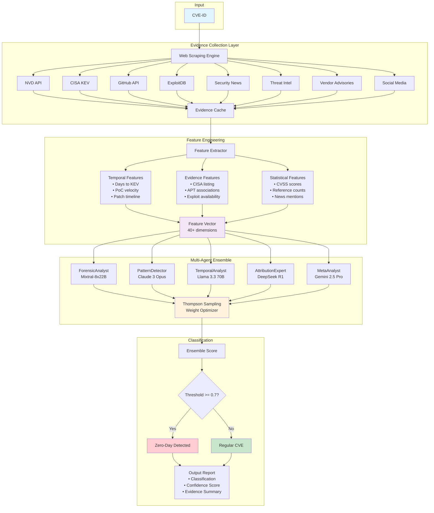
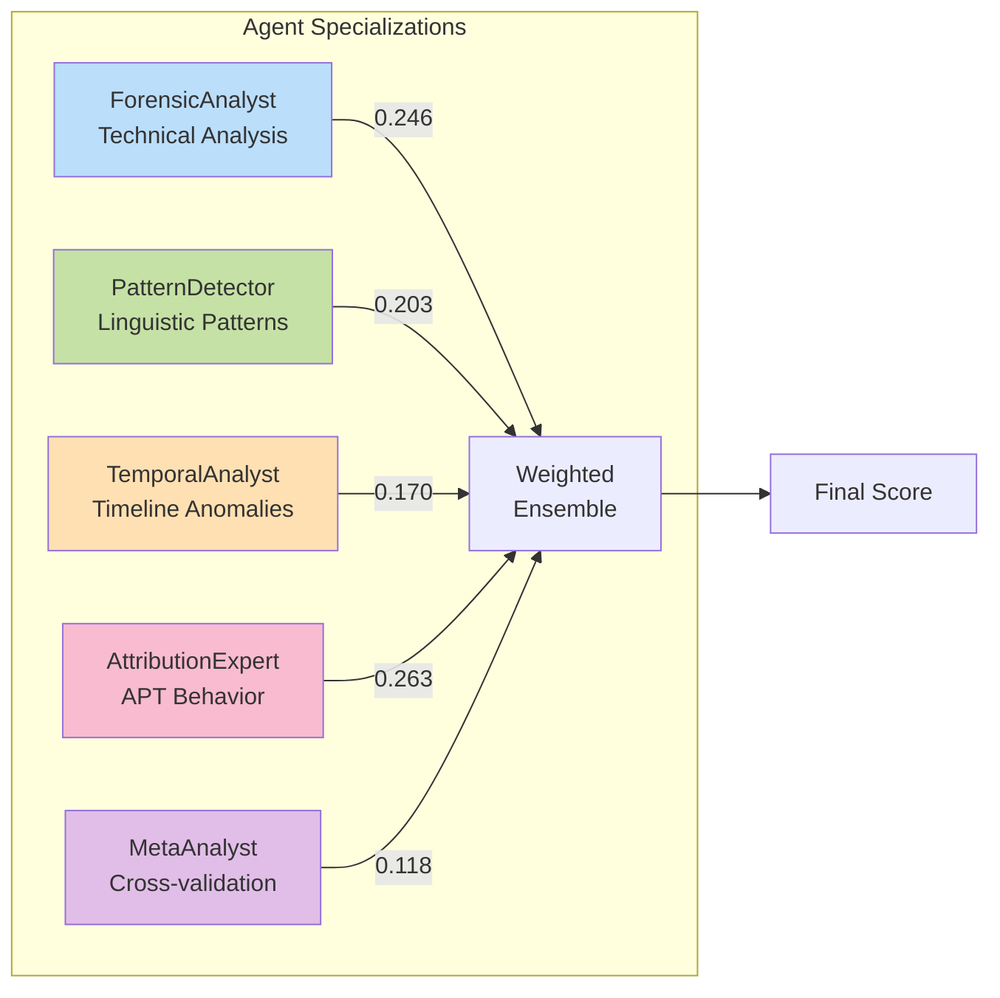
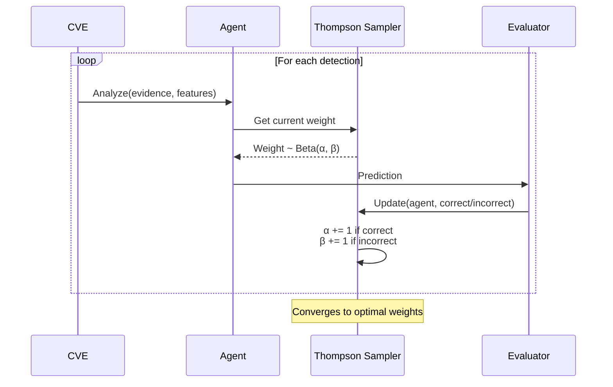
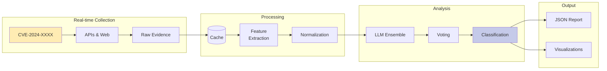

# System Architecture Diagram

## High-Level Architecture

```mermaid
graph TB
    subgraph Input
        CVE[CVE-ID]
    end
    
    subgraph "Evidence Collection Layer"
        CVE --> WS[Web Scraping Engine]
        WS --> S1[NVD API]
        WS --> S2[CISA KEV]
        WS --> S3[GitHub API]
        WS --> S4[ExploitDB]
        WS --> S5[Security News]
        WS --> S6[Threat Intel]
        WS --> S7[Vendor Advisories]
        WS --> S8[Social Media]
        
        S1 --> EC[Evidence Cache]
        S2 --> EC
        S3 --> EC
        S4 --> EC
        S5 --> EC
        S6 --> EC
        S7 --> EC
        S8 --> EC
    end
    
    subgraph "Feature Engineering"
        EC --> FE[Feature Extractor]
        FE --> TF[Temporal Features<br/>• Days to KEV<br/>• PoC velocity<br/>• Patch timeline]
        FE --> EF[Evidence Features<br/>• CISA listing<br/>• APT associations<br/>• Exploit availability]
        FE --> SF[Statistical Features<br/>• CVSS scores<br/>• Reference counts<br/>• News mentions]
        
        TF --> FV[Feature Vector<br/>40+ dimensions]
        EF --> FV
        SF --> FV
    end
    
    subgraph "Multi-Agent Ensemble"
        FV --> A1[ForensicAnalyst<br/>Mixtral-8x22B]
        FV --> A2[PatternDetector<br/>Claude 3 Opus]
        FV --> A3[TemporalAnalyst<br/>Llama 3.3 70B]
        FV --> A4[AttributionExpert<br/>DeepSeek R1]
        FV --> A5[MetaAnalyst<br/>Gemini 2.5 Pro]
        
        A1 --> TS[Thompson Sampling<br/>Weight Optimizer]
        A2 --> TS
        A3 --> TS
        A4 --> TS
        A5 --> TS
    end
    
    subgraph "Classification"
        TS --> ES[Ensemble Score]
        ES --> TH{Threshold >= 0.7?}
        TH -->|Yes| ZD[Zero-Day Detected]
        TH -->|No| REG[Regular CVE]
        
        ZD --> OUT[Output Report<br/>• Classification<br/>• Confidence Score<br/>• Evidence Summary]
        REG --> OUT
    end
    
    style CVE fill:#e1f5fe
    style ZD fill:#ffcdd2
    style REG fill:#c8e6c9
    style TS fill:#fff3e0
    style FV fill:#f3e5f5
```

## Agent Specialization Flow

```mermaid
graph LR
    subgraph "Agent Specializations"
        FA[ForensicAnalyst<br/>Technical Analysis] --> |0.246| W[Weighted<br/>Ensemble]
        PD[PatternDetector<br/>Linguistic Patterns] --> |0.203| W
        TA[TemporalAnalyst<br/>Timeline Anomalies] --> |0.170| W
        AE[AttributionExpert<br/>APT Behavior] --> |0.263| W
        MA[MetaAnalyst<br/>Cross-validation] --> |0.118| W
    end
    
    W --> FS[Final Score]
    
    style FA fill:#bbdefb
    style PD fill:#c5e1a5
    style TA fill:#ffe0b2
    style AE fill:#f8bbd0
    style MA fill:#e1bee7
```

## Thompson Sampling Algorithm

```mermaid
sequenceDiagram
    participant CVE
    participant Agent
    participant TS as Thompson Sampler
    participant Eval as Evaluator
    
    loop For each detection
        CVE->>Agent: Analyze(evidence, features)
        Agent->>TS: Get current weight
        TS-->>Agent: Weight ~ Beta(α, β)
        Agent->>Eval: Prediction
        Eval->>TS: Update(agent, correct/incorrect)
        TS->>TS: α += 1 if correct<br/>β += 1 if incorrect
    end
    
    Note over TS: Converges to optimal weights
```

## Data Flow Pipeline

```mermaid
flowchart LR
    subgraph "Real-time Collection"
        RT[CVE-2024-XXXX] --> API[APIs & Web]
        API --> RAW[Raw Evidence]
    end
    
    subgraph "Processing"
        RAW --> CACHE[(Cache)]
        CACHE --> FEAT[Feature<br/>Extraction]
        FEAT --> NORM[Normalization]
    end
    
    subgraph "Analysis"
        NORM --> LLM[LLM Ensemble]
        LLM --> VOTE[Voting]
        VOTE --> CLASS[Classification]
    end
    
    subgraph "Output"
        CLASS --> JSON[JSON Report]
        CLASS --> VIZ[Visualizations]
    end
    
    style RT fill:#ffecb3
    style CLASS fill:#c5cae9
```